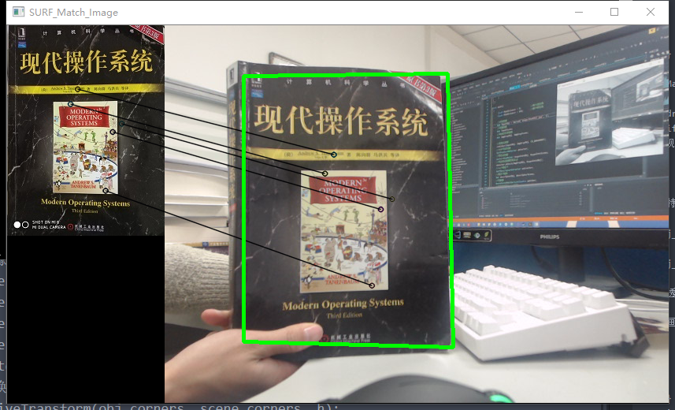

# 用SURF算法和其描述子实现视频的特征图像跟踪和标定
其实最初我是想采用`SIFT`的算子和特征点识别来进行特征图像的跟踪标定的，但是经过测试后发现`SIFT`的检测时间实在是太长了，根本不适合作为视频的特征识别的算法，所以虽然其识别准确率是最高的，但是还是只能进行舍弃

而且`SURF`虽然准确率没有`SIFT`高，但其也保留了基本的尺度不变性和旋转不变型，用作特征图像的标定其实也算不错，不过这样的方法也有很大的问题，就是每一帧都必须对全局图像进行一个特征点的描述，这样会造成每一帧的计算量太大而导致掉帧的情况。

我当前所做成的Demo也有这个问题，就是帧数过低，看起来并不流畅，但是只是对`SURF`的视频识别效率做一个测试，问题也不算太大

当然，后面我会对这个特征图像的跟踪Demo进行进一步的优化，
初步方案是采用光流金字塔`calcOpticalFlowPyrLK`和`SURF`混用的方式达到比较好的同步率，然后采用更加动态化的方式去进行对应特征点的筛选以达到更好的准确性。


----------


### 运行环境
- Visual Studio 2017 ( X86 Release ) 
- opencv 2.3.1
### Demo实现的大致步骤
1.  获取特征图像的描述子存入固定容器
2.  取一帧图像
3.  将帧图像的描述子算出并和特征图像的描述子进行对比
4.  对比得到`DMatch`对象容器，并进行筛选得到较好的匹配点和其对应的位置`points`（如何筛选`DMatch`请看[SIFT算法的特征点筛选和DMatch、Keypoint描述](http://blog.csdn.net/codedoctor/article/details/78998946)）
5.  绘制出匹配点
6.  通过获取多个点的透视变化`findHomography`函数算出`points`相对于原图像对应位置的透视矩阵
7.  通过前面的透视矩阵将帧图像中的特征图像圈出
### 代码详情
由于注释比较详细，就不多说了，直接贴代码吧
```

int main()
{
	float MaxDistance = 0;        //最大欧拉角
	float MinDistance = 999;      //最小欧拉角

	//识别图像
	Mat inputObj = imread("image/img2.jpg", 1);
	//场景图像
	Mat inputScene;
	//两者的灰度图像
	Mat imgGrayObj, imgGrayScene;

	//转换灰度图
	cvtColor(inputObj, imgGrayObj, CV_BGR2GRAY);
	//SURF特征检测
	SurfFeatureDetector detector;
	//特征点容器
	vector<KeyPoint> keypointsObj, keypointsScene;
	//找出特征图像的特征点
	detector.detect(imgGrayObj, keypointsObj);
	//surf描述子
	SurfDescriptorExtractor extractor;
	//描述子矩阵
	Mat descriptorObj, descriptorScene;
	//匹配器
	BruteForceMatcher<L2<float>> matcher;
	//匹配得到的DMatch容器
	vector<DMatch> matches;

	extractor.compute(imgGrayObj, keypointsObj, descriptorObj);

	VideoCapture camera(0);//初始化摄像头，0代表默认摄像头
	vector<DMatch> matchesVoted;//选出的优质匹配
	vector<Point2f> points1, points2;//对应点的位置
	vector<KeyPoint> imagePoints1, imagePoints2;//选出的对应优质特征点

	while (true)
	{

		if (!camera.isOpened())
		{
			cerr << "open camera error" << endl;
			break;
		}

		camera >> inputScene;//获取当前帧
		//灰度化图像
		cvtColor(inputScene, imgGrayScene, CV_BGR2GRAY);
		//找出特征点
		detector.detect(imgGrayScene, keypointsScene);
		extractor.compute(imgGrayScene, keypointsScene, descriptorScene);
		matcher.match(descriptorObj, descriptorScene, matches);
		
		//得到匹配的最大最小欧拉距离
		for (int i = 0; i < matches.size(); i++) {
			if (matches[i].distance > MaxDistance) {
				MaxDistance = matches[i].distance;
			}
			if (matches[i].distance < MinDistance) {
				MinDistance = matches[i].distance;
			}
		}

		int count = 0;
		//筛选特征点
		for (int i = 0; i < matches.size(); i++)
		{
			if (matches[i].distance <= 2.8 * MinDistance) {
				DMatch dmatch;
				dmatch.queryIdx = count;
				dmatch.trainIdx = count;
				dmatch.distance = matches[i].distance;
				matchesVoted.push_back(dmatch);
				imagePoints1.push_back(keypointsObj[matches[i].queryIdx]);
				imagePoints2.push_back(keypointsScene[matches[i].trainIdx]);
				points1.push_back(keypointsObj[matches[i].queryIdx].pt);
				points2.push_back(keypointsScene[matches[i].trainIdx].pt);
				count++;
			}
		}

		Mat img_matches;

		drawMatches(inputObj, imagePoints1, inputScene, imagePoints2, matchesVoted, img_matches, DrawMatchesFlags::NOT_DRAW_SINGLE_POINTS);
		if (points1.size() >= 4) {//是否具备进行透视矩阵变换的基础
    //透视变换
			Mat h = findHomography(points1, points2, CV_RANSAC);

			std::vector<Point2f> obj_corners(4);
      //特征图像中的四个顶点位置
			obj_corners[0] = cvPoint(0, 0); 
      obj_corners[1] = cvPoint(imgGrayObj.cols, 0);
			obj_corners[2] = cvPoint(imgGrayObj.cols, imgGrayObj.rows);
      obj_corners[3] = cvPoint(0, imgGrayObj.rows);
			std::vector<Point2f> scene_corners(4);
      //透视变换将顶点位置转换成帧图像中的位置
			perspectiveTransform(obj_corners, scene_corners, h);
      //画矩阵
			line(img_matches, scene_corners[0] + Point2f(imgGrayObj.cols, 0), scene_corners[1] + Point2f(imgGrayObj.cols, 0), Scalar(0, 255, 0), 4);
			line(img_matches, scene_corners[1] + Point2f(imgGrayObj.cols, 0), scene_corners[2] + Point2f(imgGrayObj.cols, 0), Scalar(0, 255, 0), 4);
			line(img_matches, scene_corners[2] + Point2f(imgGrayObj.cols, 0), scene_corners[3] + Point2f(imgGrayObj.cols, 0), Scalar(0, 255, 0), 4);
			line(img_matches, scene_corners[3] + Point2f(imgGrayObj.cols, 0), scene_corners[0] + Point2f(imgGrayObj.cols, 0), Scalar(0, 255, 0), 4);
		}
		imshow("SURF_Match_Image", img_matches);
		//清理场景特征点容器
		matches.clear();
		keypointsScene.clear();
		matchesVoted.clear();
		points1.clear();
		points2.clear();
		imagePoints1.clear();
		imagePoints2.clear();
		waitKey(33);

	}
	return 0;
}
```
### 效果展示



### 缺点
1. **效率太低**，帧率太低，应该只有10帧左右
2. **准确度不高**，坏点的去除不完善